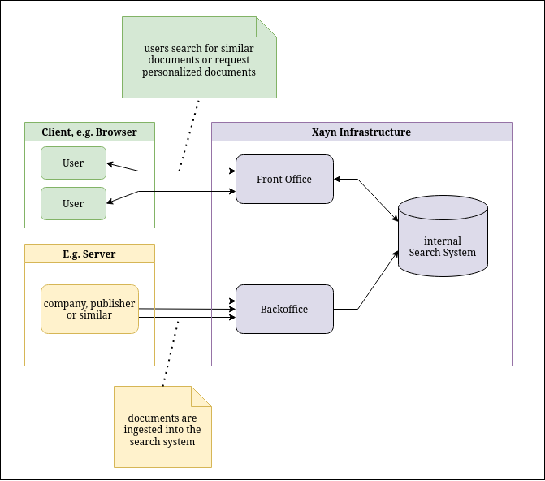

# Overview

Here we take a high-level look at how the system works. The API is divided into two parts: the back office and the front office.

The back office can be used to ingest your content into the system. Every piece of content you ingest is managed as one document within the Xayn system.

The front office is used for all communication between a client form a user. The front office mainly provides following use cases:

- semantic search, i.e. trying to find documents which are semantically similar to
    - ... a text query
    - ... a document
- personalized recommendations of documents for a  user
    - this is based on semantic representations of the users interest
    - this interests can either be aggregated on out system
    - or provided ad-hoc so that we never store user specific information

Based on this many other use cases can be implemented. For example the personalization API can be used to implement a 'for you' section and the semantic search based on a document can be used to provide a 'more like this' section or add 'more like this' functionality to a 'for you' section. Another common use-case is to use the document based semantic search to refine an existing search.



Before the search or personalization APIs can be used documents need to be ingested into our search system. In the simplest case each document will produce exactly one search target based on its content.
Through in more complex cases it can produce multiple search target and/or pre-process the content in some way. In the first part of this documentation we will only cover the case where a document directly maps to a single snippet. The following parts will cover more advanced use-cases.

In general we refer to this search targets as snippets, as at their core they are snippets of text.
From each of this snippets we will derive a mathematical representation which is used to match the snippets to the provided search queries or user's interests.

Once we have the documents in the system, we can use the front office to implement different use cases. For example, to have a ‘for you’ section, we need to add user interactions (clicks, reading, viewing) with documents or snippets. With each interaction, the system creates or updates a model that represents the user’s interests each time we add an interaction. Each user has a unique model that is used to return individually personalised search results and recommendations in form of a list of best matching snippets/documents.

In following we will first explain the general usage of the APIs in the simplest use-cases. Further below
you can find sections about [documents with multiple snippets](#documents-with-multiple-snippets), options for [document preprocessing](#document-preprocessing) and more.

# Getting started

To use the service, we first need to set up the authentication headers.
We have two authentication tokens, one to connect to the back office and one to connect to the front office.
To authenticate, we need to set the `authenticationToken` header to one of them, depending on what we need to do.
As our API expects all request bodies to be JSON encoded, we also need to set the `Content-Type` header to `application/json`.

In the following examples, we are going to use three environment variables: `$URL`, `$BACKOFFICE_TOKEN`, and `$FRONTOFFICE_TOKEN`.
To try the examples you need to set them to the values for your system beforehand:

```bash
export URL="<url>"
export BACKOFFICE_TOKEN="<backoffice_token>"
export FRONTOFFICE_TOKEN="<frontoffice_token>"
```

## Ingest

We can use the back office endpoint [`/documents`](https:/docs.xayn.com/back_office.html#operation/createDocuments) to ingest documents.

We will ingest a document that represents this article: [https://xayn.com/blog/the-initial-challenge](https://xayn.com/blog/the-initial-challenge), as well as some less meaningful examples.

```bash
curl -X POST "$URL/documents" \
    --header "authorizationToken: $BACKOFFICE_TOKEN" \
    --header "Content-Type: application/json" \
    --data '{
        "documents": [
            {
                "id": "xayn_cd5604c",
                "snippet": "The voices that are demanding better privacy protection and ownership of our own data are increasingly louder, there is a backlash towards these practices. At Xayn, our mission is to provide personalisation without user data leaving the device, maintaining absolute privacy. We use semantic similarity and centers of interest to understand user preferences and present better matching articles. With our model Xaynia, we offer semantic similarity and search with minimal energy consumption and at a low price, making it highly energy-efficient compared to other transformer models.",
                "properties": {
                    "title": "The initial challange",
                    "link": "https://xayn.com/blog/the-initial-challenge",
                    "image": "https://uploads-ssl.webflow.com/5ef08ebd35ddb63551189655/641320bc6be72c5453f4d98d_Blog%20Posts%20Visuals%20-%2003%20Mar%202023-p-2600.png",
                    "location" : ["germany", "berlin", "conference"]
                }
            },
            {
                "id": "xayn_ff5604c",
                "snippet": "If you only ingested one short document you can't really try out any of the functional, so here is another document"
            },
            {
                "id": "00000",
                "snippet": "There are just very few constraints on what an id can be, this means that most times you can just plug in ides from any other system you use to store documents in. But be aware tht ids are strings so 0, 00, and 000 are all different ids."
            },
            {
                "id": "affeffa",
                "snippet": "Privacy protection and ownership is a topic of another document, so is semantic search."
            }
        ]
    }'

```

The endpoint takes a list of documents to ingest.

Each document has a unique identifier that can be used to refer to it in the system.

The `snippet` field is used to inform the system about the content of the document; it is used as input to Xaynia to generate a mathematical representation of the document that we can use to match similar documents.

For this reason, it is essential that the snippet clearly represents the content of the document. In this case, we took a few representative sentences from the document and used them as a snippet. If you
intend to ingest larger documents the [preprocessing section](#document-preprocessing) contains some
examples about enabling the usage of a [summarizer](#summarizer) or [document splitting](#automatic-document-splitting).

The `properties` field is completely optional. It can contain custom data that can be used for [filtering](#filters) and that the system will return when a document is part of the result of a query.

The data that can be included in the properties is limited in terms of type and size. We support numbers, strings, boolean, date and list of strings, none of which are nullable. Please see [createDocuments](https://docs.xayn.com/back_office.html#tag/documents/operation/createDocuments) for more information on properties.

For example in case of a 'for you' section you could include properties containing a link to the
article, a title, a link to an image as well as a text preview or similar short description. Some
of the examples below include properties like that.

## Recommendations: Personalised documents

After ingestion, we can use the front office to retrieve recommendations, which we call personalised documents, and implement a 'for you' section.

From a system perspective, a user is represented by an ID that is needed to group their interactions. We don't need to know who this user is, so it is preferable to create this ID in a privacy-protecting way. For example, create a hash method that converts your user into an ID hash. Please ensure you don't use any sensitive or personally identifiable information (PII).

Let's use `u1234` as the user ID for our example.

We ask the system for [personalised documents](https://docs.xayn.com/front_office.html#tag/search/operation/getPersonalizedDocuments) for this user.

```bash
curl -X POST "$URL/users/u1234/personalized_documents" \
    --header "authorizationToken: $FRONTOFFICE_TOKEN" \
    --header "Content-Type: application/json"
```

As we can see, this returns with `409` status code and the following body:

```json
{ "kind": "NotEnoughInteractions" }
```

When there is an error, the system uses the `kind` field to specify what kind of error has occurred. There may also be a `details` field which can be used to better understand the error, be aware that
the exact way details are encoded is not fixed and can change.

In this case, we have `NotEnoughInteractions`. This means that the system needs to receive more interactions from the user to learn their interests and cannot provide personalised documents at this time.

We can add an [interaction](https://docs.xayn.com/front_office.html#tag/interaction) between our user `u1234` and the document `xayn_cd5604c`:

```bash
curl -X PATCH "$URL/users/u1234/interactions" \
    --header "authorizationToken: $FRONTOFFICE_TOKEN" \
    --header "Content-Type: application/json" \
    --data '{
        "documents": [
             { "id": "xayn_cd5604c" }
        ]
    }'
```

```{note}
Please note that if an interaction between a user and a document is added, the document will **not** be part of the documents returned for future calls to the personalised endpoint. This includes all snippets associated to that document.
```

Let's ask for personalised documents again now:

```bash
curl -X POST "$URL/users/u1234/personalized_documents" \
    --header "authorizationToken: $FRONTOFFICE_TOKEN" \
    --header "Content-Type: application/json" \
    --data '{
        "include_properties": true
    }'
```

As a result, we will get something like:

```json
{
  "documents": [
  {
      "id": "xayn_5283ef3",
      "snippet_id": { "document_id": "xayn_5283ef3", "sub_id": 0 },
      "score": 0.8736,
      "properties": {
          "title": "Why every bit matters",
          "link": "https://www.xayn.com/blog/why-every-bit-matters",
          "image": "https://uploads-ssl.webflow.com/5ef08ebd35ddb63551189655/61447d6ebda40f1487c6ed9a_noah-silliman-2ckQ4BrvpC4-unsplash-p-2000.jpeg"
      }
  },
  { ... },
    ...
  ]
}
```

In the request, we ask the system to include the properties of the returned documents. We can use this data to implement a 'more like this' section.

We also have a `score` field which represents how well the documents match the user's interests. The higher the number, the better the documents match. It should be noted that the scores only have meaning in relation to other
scores from the same requests.

The field `snippet_id` identifies a specific snippet instead of just the document as a whole. If you do not plan to ever have documents with multiple snippets you can ignore it. But as it's hard to predict the future needs it's highly recommended to use the whole snippet idea for use cases search refinement or a 'more like this' section. [See documents with multiple snippets](#documents-with-multiple-snippets) for more details.

If `include_properties` is set to false properties are not included in the output, you still can filter based on them.

If `include_snippet` is set to true the plain text snippet of the search result is returned. Be aware that whitespace in returned snippet can differ to the text provided to the ingestion API.

## Search

Depending on the use-case searching for documents can be achieved as a search for documents _similar_ to a given snippet/document or as a _free-text search_. Both variants can then be run as a anonymous search or a search that is personalized. Personalization comes in two fashions, with a _user-id_ or by providing a interaction _history_.

### Similar documents

In this search variant either a _document id_ or a _snippet id_ must be provided to the [`/semantic_search`](https://docs.xayn.com/front_office.html#tag/front-office/operation/getSimilarDocuments) endpoint.

```bash
curl -X POST "$URL/semantic_search" \
    --header "authorizationToken: $FRONTOFFICE_TOKEN" \
    --header "Content-Type: application/json" \
    --data '{
        "document": { "id": "xayn_cd5604c" },
        "include_properties": true
    }'
```

The result contains a list of snippets that are similar to the identified snippet.

```{note}
If this is used like shown above with a [document with multiple snippets](#documents-with-multiple-snippets) it will currently do a semantic search based on the first
snippet of the document instead of the document as a whole. In the future this behaviour likely
will change to do a search based on the whole document instead.
```

### Free Text search

Just like [Similar documents](#similar-documents) it is also possible to run a free text search.

```bash
curl -X POST "$URL/semantic_search" \
    --header "authorizationToken: $FRONTOFFICE_TOKEN" \
    --header "Content-Type: application/json" \
    --data '{
        "document": {
            "query": "Privacy and security"
        },
        "include_properties": true
    }'
```

The quality of the results can vary on the length of the provided query. Short queries usually yield better results with the [hybrid search option](https://docs.xayn.com/front_office.html#tag/front-office/operation/getSimilarDocuments) enabled, that combines semantic and lexical search:

```json
{
  "enable_hybrid_search": true,
  "document": {
      "query": "Privacy and security"
  },
  "include_properties": true
}
```

### Personalised search

To personalise search results for a specific user, any search can also be combined with an `user id` or a user `history`, which is a list of interactions of a particular user. The option to use a user history of interactions instead of a user id enables a personalised search without the need for Xayn to store a user id or history of interactions.

This is how we ask the system for a personalised search result for a [user](#recommendations-personalized-documents):

```bash
curl -X POST "$URL/semantic_search" \
    --header "authorizationToken: $FRONTOFFICE_TOKEN" \
    --header "Content-Type: application/json" \
    --data '{
        "document": { "query": "Privacy and security" },
        "personalize": {
            "exclude_seen": true,
            "user": {
                "id": "u1234"
            }
        },
        "include_properties": true
    }'
```

The result is a list of documents that match the search query, which are additionally sorted by relevance to the user's interests based on their content interactions.

Alternatively a history of interactions can be used instead of a user id to ask for personalised documents:

```json
"personalize": {
    "exclude_seen": true,
    "user": {
         "history": [
             {
                 "id": "valid_doc_id1",
                 "timestamp": "2000-05-14T20:22:50Z"
             },
             {
                 "id": "valid_doc_id2",
                 "timestamp": "2000-05-15T20:22:50Z"
             }
         ]
    }
}
```

```{note}
Please note: `"exclude_seen": true` (default true) filters out documents from search results, that were interacted with by the user or have been provided in the history.
```

Similar to other APIs it's recommended to use the snippet id instead in case you might use [documents with multiple snippets](#documents-with-multiple-snippets) in the future.

### Filters

Finding specific documents in large datasets based on a key-phrase or their relation to other documents can often be challenging. To address this issue, we can employ a structured filter on one or more of the `properties` fields to narrow down the search scope.

The `filter` functionality is available in the [`/semantic_search`](https://docs.xayn.com/front_office.html#tag/search/operation/getSimilarDocuments) and [`/users/{user_id}/personalized_documents`](https://docs.xayn.com/front_office.html#tag/search/operation/getPersonalizedDocuments) endpoints, and it involves a two-step process:

1. Indexing the desired property field for the filter to operate on.
2. Applying the `filter` in the request to `/semantic_search` or `/users/{user_id}/personalized_documents`.

```{note}
Please note that the __first step__ is necessary to leverage the filtering at all.
```

#### Indexing a filter property

First lets check which properties are already indexed:

```bash
curl -X GET "$URL/documents/_indexed_properties" \
    --header "authorizationToken: $BACKOFFICE_TOKEN"
```

This returns just the `publication_date`, which is indexed by default.

```json
{
    "properties": {
        "publication_date": {
            "type": "date"
        }
    }
}
```

Next, we can proceed to include our desired property, specifically the `tags` field, in the index. To accomplish this, we need to provide the name and type of the property. The available types for indexing are [`keyword, keyword[], boolean, date, number`](https://docs.xayn.com/back_office.html#tag/property-indexing/operation/createIndexedProperties).

```bash
curl -X POST "$URL/documents/_indexed_properties" \
    --header "authorizationToken: $BACKOFFICE_TOKEN" \
    --header "Content-Type: application/json" \
    --data '{
        "properties": {
            "location": {
                "type": "keyword[]"
            }
        }
    }'
```

After a short indexing period, depending on the number of ingested documents, we can apply filters to our requests.

#### Applying a Filter

Applying a filter then just requires to use the `filter` property in the `/semantic_search` or `/users/{user_id}/personalized_documents` query parameter. In the following two examples we simply filter for the tag `conference`.

```{code-block} bash
:caption: /semantic_search

curl -X POST "$URL/semantic_search" \
    --header "authorizationToken: $FRONTOFFICE_TOKEN" \
    --header "Content-Type: application/json" \
    --data '{
        "filter": {
            "location": {
                "$in": [
                    "conference",
                    "hamburg"
                ]
            }
        },
        "document": {
            "query": "Privacy and security"
        },
        "include_properties": true
    }'
```

In `personalized_documents` the filter is applied in a similar way:

```{code-block} bash
:caption: /users/{user_id}/personalized_documents

curl -X POST "$URL/users/u1234/personalized_documents" \
    --header "authorizationToken: $FRONTOFFICE_TOKEN" \
    --header "Content-Type: application/json" \
    --data '{
        "filter": {
            "location": {
                "$in": [
                    "conference"
                ]
            }
        },
        "include_properties": true
    }'
```

Filter APIs can also work with rfc3339 formatted strings if the field is of type `date`:

```{code-block} bash
:caption: /users/{user_id}/personalized_documents

curl -X POST "$URL/users/u1234/personalized_documents" \
    --header "authorizationToken: $FRONTOFFICE_TOKEN" \
    --header "Content-Type: application/json" \
    --data '{
        "filter": {
            "publication_date": {
                "$gte": "2022-12-30T11:30:32Z"
            }
        },
        "include_properties": true
    }'
```

# Documents with multiple Snippets

Documents can have multiple snippets, and at the core our search and recommendation system is based on the searching for and recommending snippets not documents.

When using documents with multiple snippets you need to be aware about a few things:

- there is a snippet id for each specific snippet a document has
- we search for snippets not documents, so results can contains multiple (different) snippets of the same document
- many APIs which accepts either a document id for referring to a document as a whole or a snippet id to refer to a specific snippet
    - some APIs currently fall back to using the first snippet if only document id is used, but this is intended to change in the future

We made sure that all search APIs in which you can refer to a specific snippet also work with just the document id even if the document has multiple snippets. _But_ the results might not be quite as expected as there can be a huge difference in the search results.

## Snippet Id

Snippets are identified by a snippet id consisting of both the document id and a sub id.

Each document is guaranteed to have a snippet with sub id equals `0`. But besides that
there are no guarantees about the value of the `sub_id`. E.g. a document might have snippet
id's with the sub ids `0`, `400`, `2334`.

For example if we ingest a document like

```json
{
    "id": "12345",
    "snippet": "some text"
},
```

It would have a single snippet with the id `{ "document_id": "12345", "sub_id": 0 }`.

So if we have following semantic search example

```bash
curl -X POST "$URL/semantic_search" \
    --header "authorizationToken: $FRONTOFFICE_TOKEN" \
    --header "Content-Type: application/json" \
    --data '{
        "document": { "id": "12345" },
        "include_properties": true
    }'
```

we could also use the snippet id instead like shown below

```bash
curl -X POST "$URL/semantic_search" \
    --header "authorizationToken: $FRONTOFFICE_TOKEN" \
    --header "Content-Type: application/json" \
    --data '{
        "document": { "id": { "document_id": "12345", "sub_id": 0 },
        "include_properties": true
    }'
```

This pattern of replacing document id string with a snippet id struct is also used in all other places
a snippet id can be used.

Be aware that using `{ "id": "12345" }` represents the whole document but `{ "document_id": "12345", "sub_id": 0 }` represents the first snippet specifically and for some APIs this makes a difference
for documents which have multiple embeddings as described in the sections below.

## Ingestion

Currently there are two APIs with which you can ingest documents in a way where it might
(depending on document size) produce multiple snippets:

- using the [`split` option with `snippet`](#automatic-document-splitting)
- using the [`split` option with `file`](#file-upload)

be aware that you need to use sufficient long text for it to be split.

You could use the example from the [`split` option](#automatic-document-splitting) or use
your own document, something along ~1000 words will likely generate multiple splits.

Additionally to some preprocessing options producing multiple snippets you can ingest a document with
multiple snippets yourself.

## Semantic Search

Like already mentioned the search results are based on snippets not documents so a search
can yield multiple different snippets of the same document.

The semantic search API can also be used based on a specific snippet (and for systems
with documents with multiple embeddings that is recommended):

```bash
curl -X POST "$URL/semantic_search" \
    --header "authorizationToken: $FRONTOFFICE_TOKEN" \
    --header "Content-Type: application/json" \
    --data '{
        "document": { "id": { "document_id": "effaffe", "sub_id": 2 },
        "include_properties": true
    }'
```

This will return the snippets of which the semantic representation is closest to the
semantic representation of the second snippet of the given document.

```{note}
Currently the whole document used for search is excluded from the search results.
```

For personalize semantic search with provided history snippet ids can also be used instead of
document ids:

```json
"personalize": {
    "exclude_seen": true,
    "user": {
         "history": [
             {
                 "id": { "document_id": "valid_doc_id1", "sub_id": 0 },
                 "timestamp": "2000-05-14T20:22:50Z"
             },
             {
                 "id": { "document_id": "valid_doc_id1", "sub_id": 1 },
                 "timestamp": "2000-05-15T20:22:50Z"
             }
         ]
    }
}
```

When the history contains a interaction with a document which has multiple snippets it will be
processed similar to registering an interaction which each snippet of that document.

`exclude_seen` currently always refer to whole documents, i.e. in the example above even if there
is a snippet with the id `{ "document_id": "valid_doc_id1", "sub_id": 30 }` it would be excluded as
as the whole document `"valid_doc_id1"` is excluded.

## Personalization

It is possible to register interactions with specific snippets instead of whole documents:

```bash
curl -X PATCH "$URL/users/u1234/interactions" \
    --header "authorizationToken: $FRONTOFFICE_TOKEN" \
    --header "Content-Type: application/json" \
    --data '{
        "documents": [
            { "id": { "document_id": "effaffe", "sub_id": 1 } },
            { "id": { "document_id": "effaffe", "sub_id": 2 } },
            { "id": { "document_id": "affeffa", "sub_id": 1 } }
        ]
    }'
```

When registering a interaction with a document which has multiple snippets it will be
processed similar to registering an interaction which each snippet of that document.

# Document preprocessing

The back office ingestion API provides functionality to automatically summarize the provided content.

## Summarizer

This can be used if the content is to large to be used directly as a snippet. Due to the fact that
the summarized text still has to fit into the size constraints of a snippet it is often better to
use the [automatic document splitting instead](#automatic-document-splitting).

If if a search using `include_snippet` returns a summarized document then the returned snippet will be based on the snippet provided for ingestion, not the snippet internally produced through the summarizer. Whitespace can still differ.

## Automatic document splitting

The back office ingestion API provides functionality to automatically split a document into
multiple part and create a snippet for each of this parts.

The system uses Natural language processing (NLP) algorithms to split the document into multiple parts.

This algorithm will be improved over time. This means a document ingested now and a equal document ingested
in the future might have different splits. Additionally, not all NLP splitting algorithms are deterministic so we can't guarantee fully deterministic behavior even if changes to the algorithm are ignored.

Currently, automatic splitting works only with one language set when the system is set up; by default, it is English. If you need another one, please contact us.
We are working to add support for multiple languages to our text-splitting algorithms.

Automatic splitting can be enabled on a per document bases by setting the `"split"` option
to `true` like shown in the example below.

**Be aware that if documents with multiple snippets are used it is highly recommended to use
the snippet id for many use-cases, more details can be found in the
[section about documents with multiple snippets](#documents-with-multiple-snippets)**

If if a search using `include_snippet` returns a snippet from a split document then the returned snippet will be the "split" segment produced by the splitting algorithm.

For example the ingestion of (from BAnz AT 13.07.2023 B1 page 3):

```bash
curl -X POST "$URL/documents" \
    --header "authorizationToken: $BACKOFFICE_TOKEN" \
    --header "Content-Type: application/json" \
    --data '{
        "documents": [
            {
                "id": "effaffe",
                "snippet": "6.2  Die  Vergabe  von  Unteraufträgen  hat  nach  Möglichkeit  im  Wettbewerb  zu  erfolgen.  Bei  der  Einholung  von  An-\ngeboten  für  Unteraufträge  sind  kleine  und  mittlere,  nicht  konzerngebundene  Unternehmen  soweit  möglich  zu  betei-\nligen.  Die  in  Betracht  kommenden  Unternehmen  sind  dem  Auftraggeber  vom  Auftragnehmer  auf  Verlangen  vor  der\nErteilung des Unterauftrags zu benennen.\n6.3  Der Auftragnehmer zeigt dem Auftraggeber jeden Unterauftrag sowie jeden Wechsel eines Unterauftragnehmers\nnach Erteilung des jeweiligen Unterauftrags bis zum Ende der jeweiligen Vertragslaufzeit unverzüglich und unaufge-\nfordert in Textform an. Maßgeblich ist das Datum des Vertragsschlusses. Dabei teilt der Auftragnehmer  mindestens\nden Namen und die Anschrift des Unterauftragnehmers mit sowie den Gegenstand des Unterauftrags. Die Anzeige-\npflicht  entfällt,  wenn  dem  Auftraggeber  die  Informationen  bereits  aus  dem  Angebot  des  Auftragnehmers  bzw.  den\nVergabeunterlagen bekannt sind.\n6.4  Hat der Auftraggeber in der Bekanntmachung oder in den Vergabeunterlagen Anforderungen über die Eignung\noder Auftragserfüllung für Unterauftragnehmer aufgestellt, sind diese von allen Unterauftragnehmern zu erfüllen. Dies\ngilt auch im Fall des Austauschs von Unterauftragnehmern während der Vertragslaufzeit. Der Auftragnehmer legt dem\nAuftraggeber  erforderliche  Nachweise  seiner  Unterauftragnehmer  unverzüglich  und  unaufgefordert  mit  der  Anzeige\ngemäß Nummer 6.3 vor.\n6.5  Vergibt der Auftragnehmer Unteraufträge, so hat er durch entsprechende Vereinbarungen mit den Unterauftrag-\nnehmern  dem  Auftraggeber  die  gleichen  Rechte  und  Ansprüche  zu  verschaffen,  die  der  Auftraggeber  gegen  den\nAuftragnehmer hat. Hierzu gehören auch die Nutzungsrechte des Auftraggebers an allen vom Auftragnehmer geschul-\ndeten Vertragsergebnissen.\n6.6  Gelingt dies dem Auftragnehmer im Einzelfall nicht, so hat er den Auftraggeber darüber unverzüglich in Textform\nzu  unterrichten  und  ihm  auf  Verlangen  Gelegenheit  zu  geben,  an  den  weiteren  Verhandlungen  mit  dem  jeweiligen\nUnterauftragnehmer teilzunehmen und die Entscheidung des Auftraggebers abzuwarten.\n6.7  Akzeptiert der Unterauftragnehmer die Vereinbarung entsprechender Regelungen nach Abschluss der weiteren\nVerhandlungen  nicht,  hat  der  Auftragnehmer  dies  dem  Auftraggeber  in  Textform  anzuzeigen,  das  Verhandlungs-\nergebnis vorzulegen und die Entscheidung des Auftraggebers darüber, ob er seine Einwilligung zum Vertragsschluss\nerklärt, einzuholen. Entscheidet sich der Auftraggeber nicht binnen eines Monats nach Zugang der Anzeige, so ist der\nAuftragnehmer  berechtigt,  den  Unterauftrag  entsprechend  dem  vorgelegten  Verhandlungsergebnis  abzuschließen.\nErteilt der Auftraggeber seine ausdrückliche Einwilligung zum Vertragsschluss oder erfolgt der Vertragsschluss nach\nAblauf der Monatsfrist, bleibt die Haftung des Auftragnehmers für die vertragsgemäße Ausführung seiner Leistungen\ngegenüber dem Auftraggeber unberührt.",
                "split": true
            }
        ]
    }'

```

could split the text into three part:

- `"snippet_id": { document_id: "effaffe",  sub_id: 0 }` containing `"6.2  Die  Vergabe  von  Unteraufträgen  hat  nach  Möglichkeit  im  Wettbewerb  zu  erfolgen.\n\nBei  der  Einholung  von  An-\ngeboten  für  Unteraufträge  sind  kleine  und  mittlere,  nicht  konzerngebundene  Unternehmen  soweit  möglich  zu  betei-\nligen.\n\nDie  in  Betracht  kommenden  Unternehmen  sind  dem  Auftraggeber  vom  Auftragnehmer  auf  Verlangen  vor  der\nErteilung des Unterauftrags zu benennen.\n\n6.3  Der Auftragnehmer zeigt dem Auftraggeber jeden Unterauftrag sowie jeden Wechsel eines Unterauftragnehmers\nnach Erteilung des jeweiligen Unterauftrags bis zum Ende der jeweiligen Vertragslaufzeit unverzüglich und unaufge-\nfordert in Textform an.\n\nMaßgeblich ist das Datum des Vertragsschlusses.\n\nDabei teilt der Auftragnehmer  mindestens\nden Namen und die Anschrift des Unterauftragnehmers mit sowie den Gegenstand des Unterauftrags.\n\nDie Anzeige-\npflicht  entfällt,  wenn  dem  Auftraggeber  die  Informationen  bereits  aus  dem  Angebot  des  Auftragnehmers  bzw.\n\nden\nVergabeunterlagen bekannt sind.\n\n6.4  Hat der Auftraggeber in der Bekanntmachung oder in den Vergabeunterlagen Anforderungen über die Eignung\noder Auftragserfüllung für Unterauftragnehmer aufgestellt, sind diese von allen Unterauftragnehmern zu erfüllen.\n\nDies\ngilt auch im Fall des Austauschs von Unterauftragnehmern während der Vertragslaufzeit."`
- `"snippet_id": { document_id: "effaffe",  sub_id: 1 }` containing `"Der Auftragnehmer legt dem\nAuftraggeber  erforderliche  Nachweise  seiner  Unterauftragnehmer  unverzüglich  und  unaufgefordert  mit  der  Anzeige\ngemäß Nummer 6.3 vor.\n\n6.5  Vergibt der Auftragnehmer Unteraufträge, so hat er durch entsprechende Vereinbarungen mit den Unterauftrag-\nnehmern  dem  Auftraggeber  die  gleichen  Rechte  und  Ansprüche  zu  verschaffen,  die  der  Auftraggeber  gegen  den\nAuftragnehmer hat.\n\nHierzu gehören auch die Nutzungsrechte des Auftraggebers an allen vom Auftragnehmer geschul-\ndeten Vertragsergebnissen.\n\n6.6  Gelingt dies dem Auftragnehmer im Einzelfall nicht, so hat er den Auftraggeber darüber unverzüglich in Textform\nzu  unterrichten  und  ihm  auf  Verlangen  Gelegenheit  zu  geben,  an  den  weiteren  Verhandlungen  mit  dem  jeweiligen\nUnterauftragnehmer teilzunehmen und die Entscheidung des Auftraggebers abzuwarten.\n\n6.7  Akzeptiert der Unterauftragnehmer die Vereinbarung entsprechender Regelungen nach Abschluss der weiteren\nVerhandlungen  nicht,  hat  der  Auftragnehmer  dies  dem  Auftraggeber  in  Textform  anzuzeigen,  das  Verhandlungs-\nergebnis vorzulegen und die Entscheidung des Auftraggebers darüber, ob er seine Einwilligung zum Vertragsschluss\nerklärt, einzuholen."`
- `"snippet_id": { document_id: "effaffe",  sub_id: 2 }` containing `"Entscheidet sich der Auftraggeber nicht binnen eines Monats nach Zugang der Anzeige, so ist der\nAuftragnehmer  berechtigt,  den  Unterauftrag  entsprechend  dem  vorgelegten  Verhandlungsergebnis  abzuschließen.\n\nErteilt der Auftraggeber seine ausdrückliche Einwilligung zum Vertragsschluss oder erfolgt der Vertragsschluss nach\nAblauf der Monatsfrist, bleibt die Haftung des Auftragnehmers für die vertragsgemäße Ausführung seiner Leistungen\ngegenüber dem Auftraggeber unberührt."`

## File Upload

_The text extraction features is not enabled/available by default_ contact Xayn if you do need it.

Documents are often in other format then plain text. When ingesting you can decide to provide a
document "file" instead of a snippet. If you do so we will try to extract snippets from the given
file.

Currently this option can only be used together with the split option and follwing file formats are supported: `application/pdf`, `text/plain`, `text/html`.

The "file" is provided base64 encoded, so if we reuse the example from the getting started section
provding the snippet as `text/plain` file would be done like following:

```bash
curl -X POST "$URL/documents" \
    --header "authorizationToken: $BACKOFFICE_TOKEN" \
    --header "Content-Type: application/json" \
    --data '{
        "documents": [
            {
                "id": "xayn_cd5604c",
                "file": "VGhlIHZvaWNlcyB0aGF0IGFyZSBkZW1hbmRpbmcgYmV0dGVyIHByaXZhY3kgcHJvdGVjdGlvbiBhbmQgb3duZXJzaGlwIG9mIG91ciBvd24gZGF0YSBhcmUgaW5jcmVhc2luZ2x5IGxvdWRlciwgdGhlcmUgaXMgYSBiYWNrbGFzaCB0b3dhcmRzIHRoZXNlIHByYWN0aWNlcy4gQXQgWGF5biwgb3VyIG1pc3Npb24gaXMgdG8gcHJvdmlkZSBwZXJzb25hbGlzYXRpb24gd2l0aG91dCB1c2VyIGRhdGEgbGVhdmluZyB0aGUgZGV2aWNlLCBtYWludGFpbmluZyBhYnNvbHV0ZSBwcml2YWN5LiBXZSB1c2Ugc2VtYW50aWMgc2ltaWxhcml0eSBhbmQgY2VudGVycyBvZiBpbnRlcmVzdCB0byB1bmRlcnN0YW5kIHVzZXIgcHJlZmVyZW5jZXMgYW5kIHByZXNlbnQgYmV0dGVyIG1hdGNoaW5nIGFydGljbGVzLiBXaXRoIG91ciBtb2RlbCBYYXluaWEsIHdlIG9mZmVyIHNlbWFudGljIHNpbWlsYXJpdHkgYW5kIHNlYXJjaCB3aXRoIG1pbmltYWwgZW5lcmd5IGNvbnN1bXB0aW9uIGFuZCBhdCBhIGxvdyBwcmljZSwgbWFraW5nIGl0IGhpZ2hseSBlbmVyZ3ktZWZmaWNpZW50IGNvbXBhcmVkIHRvIG90aGVyIHRyYW5zZm9ybWVyIG1vZGVscy4=",
                "properties": {
                    "title": "The initial challange",
                    "link": "https://xayn.com/blog/the-initial-challenge",
                    "image": "https://uploads-ssl.webflow.com/5ef08ebd35ddb63551189655/641320bc6be72c5453f4d98d_Blog%20Posts%20Visuals%20-%2003%20Mar%202023-p-2600.png",
                    "location" : ["germany", "berlin", "conference"]
                },
                "split": true
            }
        ]
    }'

```

Be aware that this always has the potential to produce [multiple snippets](#documents-with-multiple-snippets).

# Candidates API

The [`/candidates`](https://docs.xayn.com/back_office.html#tag/candidates) api is a set back-office requests that allows to globally define the documents that all apis can recommend or generate search results from. Snippets from documents that are not part of the candidates set will not be included in search results or recommendations, but interactions with these documents are still stored and can still be recorded.

Be aware that the candidates API is based on whole documents, it is not possible to set specific snippets.

After ingesting documents we can check the candidates:

```bash
curl -X GET "$URL/documents/candidates" \
    --header "authorizationToken: $BACKOFFICE_TOKEN"
```

This returns a list with all documents ids. By default all newly ingested documents are set to be candidates. This behavior can be changed by passing [`is_candidate`](https://docs.xayn.com/back_office.html#tag/documents/operation/createDocuments) or [`default_is_candidate`](https://docs.xayn.com/back_office.html#tag/documents/operation/createDocuments) in the ingestion request.

Then we can __change__ the candidates by sending a list of document-ids to the `candidates` endpoint:

```bash
curl -X PUT "$URL/documents/candidates" \
    --header "authorizationToken: $BACKOFFICE_TOKEN" \
    --header "Content-Type: application/json" \
    --data '{
        "documents": [
            { "id": "xayn_cd5604c" },
            { "id": "xayn_5283ef3" },
            { "id": "xayn_97afa2a" }
        ]
    }'
```

```{note}
Please note, that setting candidates can only be undone by sending the complete list of all ingested document-ids again.
```

The candidates can facilitate fast transitions between different sets of documents without compromising the users' centers of interest (COIs) with which they were engaging. One practical scenario is handling outdated news articles that should not reappear in the recommendations. However, the past user interactions with those outdated articles should still influence the suggested documents.
